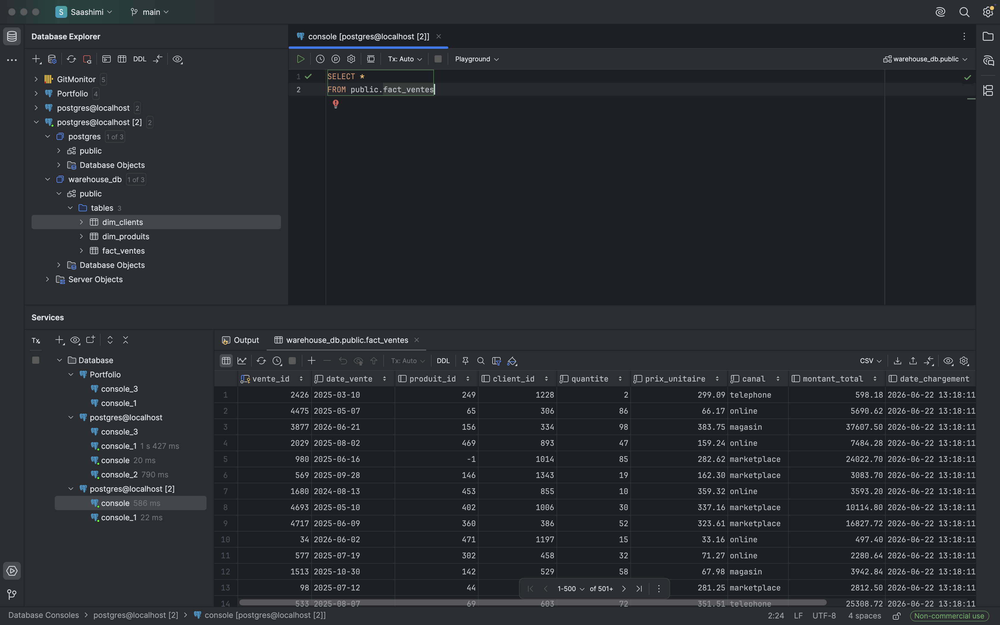

# dag_ventes_csv

Extrait les ventes depuis un fichier CSV, nettoie les données et les charge dans `fact_ventes`.

<div class="dag-meta">
  <span class="dag-meta-item"><svg xmlns="http://www.w3.org/2000/svg" viewBox="0 0 24 24" width="13" height="13" fill="currentColor"><path d="M12 2C6.5 2 2 6.5 2 12s4.5 10 10 10 10-4.5 10-10S17.5 2 12 2zm0 18c-4.41 0-8-3.59-8-8s3.59-8 8-8 8 3.59 8 8-3.59 8-8 8zm.5-13H11v6l5.25 3.15.75-1.23-4.5-2.67V7z"/></svg> <strong>Schedule</strong> 0 2 * * * — 02h00 UTC</span>
  <span class="dag-meta-item"><svg xmlns="http://www.w3.org/2000/svg" viewBox="0 0 24 24" width="13" height="13" fill="currentColor"><path d="M19 9h-4V3H9v6H5l7 7 7-7zM5 18v2h14v-2H5z"/></svg> <strong>Source</strong> /data/ventes.csv</span>
  <span class="dag-meta-item"><svg xmlns="http://www.w3.org/2000/svg" viewBox="0 0 24 24" width="13" height="13" fill="currentColor"><path d="M9 16h6v-6h4l-7-7-7 7h4zm-4 2h14v2H5z"/></svg> <strong>Cible</strong> warehouse_db · fact_ventes</span>
  <span class="dag-meta-item"><svg xmlns="http://www.w3.org/2000/svg" viewBox="0 0 24 24" width="13" height="13" fill="currentColor"><path d="M15 1H9v2h6V1zm-4 13h2V8h-2v6zm8.03-6.61 1.42-1.42c-.43-.51-.9-.99-1.41-1.41l-1.42 1.42C16.07 4.74 14.12 4 12 4c-4.97 0-9 4.03-9 9s4.02 9 9 9 9-4.03 9-9c0-2.12-.74-4.07-1.97-5.61zM12 20c-3.87 0-7-3.13-7-7s3.13-7 7-7 7 3.13 7 7-3.13 7-7 7z"/></svg> <strong>Timeout</strong> 10 min</span>
  <span class="dag-meta-item"><svg xmlns="http://www.w3.org/2000/svg" viewBox="0 0 24 24" width="13" height="13" fill="currentColor"><path d="M17.65 6.35C16.2 4.9 14.21 4 12 4c-4.42 0-7.99 3.58-7.99 8s3.57 8 7.99 8c3.73 0 6.84-2.55 7.73-6h-2.08c-.82 2.33-3.04 4-5.65 4-3.31 0-6-2.69-6-6s2.69-6 6-6c1.66 0 3.14.69 4.22 1.78L13 11h7V4l-2.35 2.35z"/></svg> <strong>Retries</strong> 0</span>
</div>

---

## Flux

```
extract_csv  →  clean_data  →  load_warehouse
```

Les données transitent entre les tâches via **XCom** (sérialisées en JSON).

---

## Schéma de la table cible

| Colonne | Type | Contrainte |
|---------|------|------------|
| `vente_id` | `BIGINT` | `PRIMARY KEY` |
| `date_vente` | `DATE` | `NOT NULL` |
| `produit_id` | `INTEGER` | FK → -1 si inconnu |
| `client_id` | `INTEGER` | FK → -1 si inconnu |
| `quantite` | `INTEGER` | `NOT NULL` |
| `prix_unitaire` | `DECIMAL(10,2)` | `NOT NULL` |
| `canal` | `VARCHAR(50)` | `NOT NULL` |
| `montant_total` | `DECIMAL(12,2)` | calculé |

---

## Transformations appliquées

- Déduplication sur `vente_id`
- Normalisation des dates — formats `YYYY-MM-DD` et `DD/MM/YYYY` acceptés
- Nettoyage des espaces sur `prix_unitaire`, conversion en `float`
- Suppression des lignes avec `quantite < 0`
- Remplacement des `NULL` sur `client_id` / `produit_id` par `-1`
- Calcul de `montant_total = quantite × prix_unitaire`
- Validation des contraintes `NOT NULL` — lignes invalides rejetées
- Stratégie de chargement : `INSERT … ON CONFLICT (vente_id) DO UPDATE`

---

## Code & Tests

=== "Code"

    ```python title="etl/dags/dag_ventes_csv.py" linenums="1"
    --8<-- "etl/dags/dag_ventes_csv.py"
    ```

=== "Tests"

    ```python title="etl/tests/test_dag_ventes_csv.py" linenums="1"
    --8<-- "etl/tests/test_dag_ventes_csv.py"
    ```

=== "Résultats"

    
