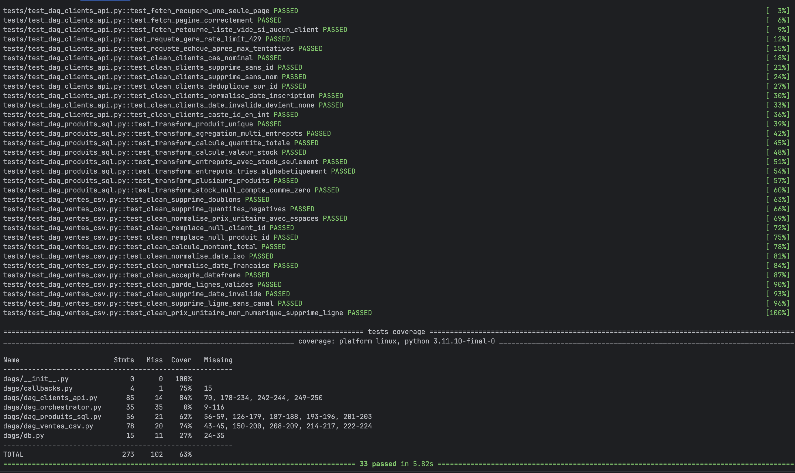

# ETL Pipelines Documentation

Trois DAGs Airflow alimentent quotidiennement un warehouse PostgreSQL à partir de trois sources hétérogènes.

---

## Architecture

```
API clients       →   dag_clients_api    →   dim_clients
CSV ventes        →   dag_ventes_csv     →   fact_ventes
Source DB SQL     →   dag_produits_sql   →   dim_produits                                                 
                      dag_orchestrator   →   data_quality_check
```

---

## DAGs

| DAG | Source | Table cible | Schedule |
|-----|--------|-------------|----------|
| [dag_ventes_csv](dags/ventes-csv.md) | `/data/ventes.csv` | `fact_ventes` | `0 2 * * *` |
| [dag_clients_api](dags/clients-api.md) | API REST paginée | `dim_clients` | `30 2 * * *` |
| [dag_produits_sql](dags/produits-sql.md) | PostgreSQL source | `dim_produits` | `0 3 * * *` |
| [dag_orchestrator](dags/orchestrator.md) | — | Contrôle qualité | `45 1 * * *` |

---

## Stack technique

- **Orchestration** : Apache Airflow 2.10
- **Warehouse** : PostgreSQL 15
- **Traitement** : Python 3.11 · pandas 2.1
- **Tests** : pytest 8.3 · couverture 63 %
- **Infra** : Docker Compose

---

## Lancer les tests

```bash
make test
```

Exécute pytest dans le container Airflow avec rapport de couverture.


